Projecting onto tongue surface data with principal curves
================
Ian Calloway
June 2, 2020

  - [What are Principal Curves?](#what-are-principal-curves)
  - [Pakcage Info](#pakcage-info)
  - [Defining Coordinates](#defining-coordinates)
      - [PCA](#pca)
      - [Principal Curves](#principal-curves)
  - [Tongue Surface Data](#tongue-surface-data)

<style>
body {
text-align: justify}
</style>

``` r
knitr::opts_chunk$set(fig.width=12, fig.height=8, warning=FALSE, message=FALSE)

## LIBRARIES##
library(data.table)
library(princurve)
library(ggplot2)
library(viridis)
library(mgcv)
library(plyr)

theme(plot.margin=grid::unit(c(0,0,0,0), "mm"))
theme_set(theme_gray(base_size=30))
```

## What are Principal Curves?

Principal curves are “smooth one-dimensional curves that pass through
the *middle* of a p-dimensional set, providing a nonlinear summary of
the data.” (Hastie and Steutzle, 1989, p. 502). They have the following
properties:

  - **Non-Parametric**: A principal curve
    
    does not depend on any specific distributional assumptions about the
    data set.
  - **Projection**: The projection onto the principal curve will always
    be the closest point on the curve. For all vectors
    ,
    there is a function
    ,
    where
    .
  - **Self-Consistency**:
    
    is the expected value for all points
    
    that project onto it, where
    
    is the data set.

Several of these properties are shared by principal component analysis
(PCA). PCA is also non-parametric, shows *self-consistency*, and points
projected onto the line spanned by the first principal component share
the same *projection* property shown above. In this sense, principal
curves resemble a non-linear extension of PCA.

This intuition behind principal curves can also be extended to higher
dimensional manifolds (e.g., principal surfaces). Principal manifolds
can be a useful way to characterize the variability and central tendency
of a data set with some degree of curvature.

Tongues naturally curve from the oral cavity into the pharynx,
regardless of its configuration. Consequently, a constriction formed by
the tongue and the vocal tract does not correspond to movement in a
single direction. A constriction formed at the palate can be created by
upward movement of the tongue body while a constriction formed at the
pharynx may be created by horizontal movement of the tongue root.

Principal curves can capture the curvature common to the tongue shapes
in a given set data set. The remaining variability may capture
differences in exact degree or location of a tongue constriction.

This page a mixture of code that you can use if you want to perform your
own analysis in R as well as some interesting visualizations of results.

*This is a work in progress - I plan to add additional sections as I get
the time\!*

-----

## Pakcage Info

Conveniently enough, there is already a package that implements
principal curves in R - this analysis is largely based off functions
from **princurve**, in particular:

  - **principal\_curve** (formerly **principal.curve**): This function
    uses an iterative algorithm to identify a principal curve from a
    data set.
  - **project\_to\_curve**: As you might guess, this function projects
    data points onto a pre-defined curve.

Although this package does much of the heavy lifting, I have also
included **orth\_proj** to obtain orthogonal projections of the data
onto an arbitrary curve as well as several helper functions, which can
be found directly below.

``` r
## next_change: Returns the indices corresponding to the next change in value
## nums: a matrix of values
## rev: T/F; whether to start from the bottom of 'nums'
## tol: minimal difference corresponding to inequality
next_change <- function(nums,rev,tol=1e-10){
  indices = 1:nrow(nums)
  step= 1
  if (rev){
    indices=rev(indices)
    step = -1
  }
  marker=indices[1]
  
  values <- c()
  for (a in indices){
    b=marker
    while(b >= 1 && b <= nrow(nums) && all(nums[a,] - nums[b,] <tol)){
        b=b+step
    }
    
    if(b>=1 && b <=nrow(nums)){ ## Mark appropriate rows
      marker=b  
      values <-c(values,marker) ## Or mark NAs
    } else{
      marker=a
      values <-c(values,NA)
    }
    
  }
  if(rev){
    return(rev(values))
  } else {
    return(values)
  }
}

## orth_proj: Returns the orthogonal projection of a data set onto an arbitrary curve
## points - points from a data set
## s - the projection of 'points' onto the curve
## ord - the row-wise ordering of 'points' such that s[ord,] would form a smooth curve
orth_proj <- function(point,s,ord){
    diff_vec <- point-s    
    ordering <- cbind(ord,rev=1:length(ord))
    ordering <- ordering[order(ordering[,1]),]    
    
    simp <- cbind(s, ordering)
    simp <- simp[order(simp[,4]),]
    
    simp[,c(1,2)] <- simp[,c(1,2)] - simp[next_change(simp[,c(1,2)],T),c(1,2)]

    simp <- simp[order(simp[,3]),]

    distance <- sqrt(rowSums(diff_vec^2))
    direction <- sign(simp[,1]*diff_vec[,2] - simp[,2]*diff_vec[,1])
    return(direction*distance)
}

## proj_simple: Projects data points from x onto y
# x,y - Two matrices; must have the same number of columns
# endpoint - whether to treat the orthogonal projection of points projected onto the principal curve end points as NA
# tol - maximal difference for equality (to catch rounding errors)
# trim - whether to treat many points projected to the same point as NA. If a curve violates smoothness assumptions, this clustering of points can happen.
# threshold - maximal percentage of total points that can map to a single lambda value (relevant if trim=T)
proj_simple <- function(x,y,endpoint=T, tol=1e-4, trim=T,threshold=0.05){
  test_proj <- project_to_curve(rbind(as.matrix(x),as.matrix(y)),as.matrix(y),stretch=0)
  x_f <- as.data.frame(
    cbind(
      lambda=test_proj$lambda,
      c=orth_proj(rbind(as.matrix(x),as.matrix(y)), test_proj$s, test_proj$ord)
      )
    )[1:nrow(x),]
  
  ylam <- range(test_proj$lambda[nrow(x)+1:length(test_proj$lambda)],na.rm=T)

  ## Option: remove points projected to endpoints
  if(endpoint){ 
    ind <- which(x_f$lambda <= (ylam[1] + tol) | x_f$lambda >= (ylam[2]-tol))
    if(length(ind)>0){
      x_f[ind,]$c <- NA
    }
  }

  ## Option: remove points that are uniformly projecting to a single point on the curve
  if(trim){
    excess <- as.numeric(names(table(x_f$lambda))[table(x_f$lambda) > threshold*nrow(x_f)])
    if(length(excess)>0){
      ind <- sapply(x_f$lambda, function(x) any(abs(x - excess) < tol))
      if(length(ind)>0){
        x_f[ind,]$c <- NA  
      }
    }
  }
  return(x_f)
}
```

-----

## Defining Coordinates

### PCA

It is possible to project the data onto its principal components. For
example, for a vector

in the data set and **PC1** as the first principal component:

<p align="center">


</p>

<p align="center">


</p>

where

is a projection matrix onto the first principal component,

are scalars,

is a unit length vector parallel to the first principal component, and

is a unit length vector orthogonal to the first principal component and
parallel to
.

and

add up to

and are orthogonal to one another.


form an orthogonal basis in
,
and the coordinate vector
.

#### Plot Generating Code

The code below can be used to help get a feel for what effect projection
onto an arbitrary principal component (or principal curve) has on the
data. It takes as input:

1.  A range (the same range is used for both x and y axes)

2.  A sampling step

3.  An arbitrary function
    ()

It returns three plots:

1.  A grid displaying the function and each arrows from each point to
    its projection on the principal curve

2.  A grid displaying the finite gradient magnitude for each point on
    the grid

3.  A plot of each point on the grid in the coordinate vector
    .

<!-- end list -->

``` r
example1 <- function(range,step, mapping){
  tol <- 1e-10
  
  grange <- seq(range[1],range[2],step)
  grange_narrow <- seq(range[1],range[2],step/5)
  
  grid <- expand.grid(grange,grange)
  grid_narrow <- expand.grid(grange_narrow,grange_narrow)
  
  x <- grange_narrow
  data <- as.matrix(cbind(x,y=mapping(x)))
  projections <- project_to_curve(as.matrix(grid),as.matrix(data))
  grid$angle <- apply(projections$s - grid,1, function(x){
    if (abs(x[1]) < tol & abs(x[2]) < tol){
      return(NA)
    } else {
      return(atan2(x[2],x[1]))
    }
  })
  data_f<-as.data.frame(data)
  
  
  p1<-ggplot() +
  geom_spoke(data=grid, aes(x=Var1, y=Var2, angle=angle, radius=0.4/2, colour=Var2), arrow = arrow(length = unit(.05, 'inches')),size=2)+
  geom_line(data=data_f[data_f$y >= range[1] & data_f$y <= range[2],], aes(x=x,y=y),colour="black",size=1) +
  scale_colour_viridis()+
  labs(x="x",y="y", colour="y")
  
  projections_narrow <- project_to_curve(as.matrix(grid_narrow),as.matrix(data))

  
  diffs <- cbind(grid_narrow,projections_narrow$s - grid_narrow)
  ## Identifying trouble spots
  xs <- diffs[,-c(4)]
  ys <- diffs[,-c(3)]
  
  xs_m <- daply(xs, .(Var1,Var2), function(x) x$"Var1.1")
  ys_m <- daply(ys, .(Var1,Var2), function(x) x$"Var2.1")

  xs_shift <- rbind(xs_m[2:nrow(xs_m),],rep(NA,ncol(xs_m)))
  colnames(xs_shift) <- NULL
  row.names(xs_shift) <- NULL

  ys_shift <- cbind(ys_m[,2:ncol(ys_m)],rep(NA,nrow(ys_m)))
  colnames(ys_shift) <- NULL
  row.names(ys_shift) <- NULL


  xdiff <- abs(xs_m - xs_shift)
  ydiff <- abs(ys_m - ys_shift)
  absol <-sqrt(ydiff^2 + xdiff^2)

  absol_df <- adply(absol,c(1,2),function(x) x)
  colnames(absol_df)[1:2] <- c('x','y')
  
  p2 <- ggplot()+
  geom_tile(data=absol_df[complete.cases(absol_df),], aes(x=as.numeric(as.character(x))+step/10, y=as.numeric(as.character(y))+step/10, fill=V1))+
  geom_line(data=data_f[data_f$y >= range[1] & data_f$y <= range[2],], aes(x=x,y=y),colour="red",size=1)+
  scale_fill_viridis(option="B")+
  labs(title="Finite gradient magnitude", x="x", y="y", fill="FGM")

   
  grid$type <- "grid"
  
  projections <- grid[,c(1,2,4)]
  
  projections_f <- cbind(projections,proj_simple(as.matrix(projections[,c(1,2)]),as.matrix(data)))
   
   p3 <- ggplot() +
     geom_point(data=projections_f[projections_f$type == 'grid',], aes(x=lambda, y=c, colour=Var2, group=Var1),size=2)+
     geom_text(data=projections_f[projections_f$type == 'grid',], aes(x=lambda, y=c, colour=Var2, label=Var1),size=4,vjust=2)+
     scale_colour_viridis(option="viridis")+
     labs(x="\u03BB",y="c", title="Local Coordinates",colour="y")
   return(list(p1,p2,p3))
   
  
}
```

-----

#### Example 1: Projecting onto 

The figure below is a visualization of what it would look like if all
points were projected onto a principal component spanned by
.
For each point in the grid, the arrow is pointed in the direction of the
place on the principal curve that it would project to. All points below
the line point in the direction of
,
and those above the line point in the exact opposite direction.

``` r
result <- example1(c(-5,5),0.5, function(x) x)
print(result[[1]])
```

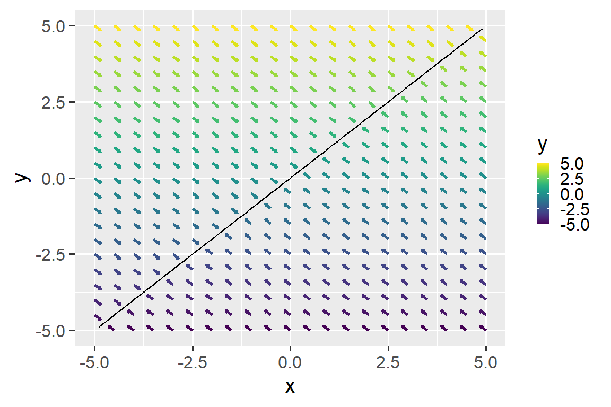<!-- -->

If we use the coordinate vectors

to plot each point on the grid, then we get the figure below.

  - The color of the point corresponds to its original y-value

  - The value below each point corresponds to its original x-value.

In this new coordinate system, the data have essentially been rotated 45
degrees clockwise.

``` r
print(result[[3]])
```

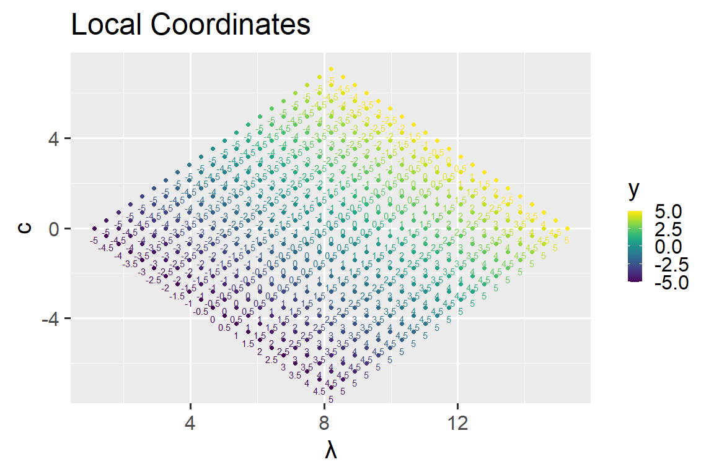<!-- -->

-----

### Principal Curves

There is not a guaranteed linear transformation for a projection onto a
principal curve. However, one can define *local coordinates* based on
projections onto the curve.

Let

be a smooth function that maps real values to points on the principal
curve -
.

As noted earlier, all

can be projected onto the principal curve.

<p align="center">


</p>

If there is only one point on the curve closest to
,
then that point is the projection. If there are multiple points,
however, then the point corresponding to the largest

is chosen. While this guarantees that every point in

will project to the principal curve, it will also create some headaches.

The difference of the vector and its projection onto the curve is:

<p align="center">


</p>

Where

is a unit vector parallel to
.
While

is the same for different points along the principal component line,

is not guaranteed to be the same for different points along the
principal curve.

The projection and the orthogonal projection still sum to
.
If

is differentiable around
,
where
,
then:

<p align="center">


</p>

The line tangent to the curve where where

projects onto the principal curve is orthogonal to
.

-----

#### A Coordinate Chart

We can use a principal curve to define local coordinates according to a
point’s position relative to the curve. Unfortunately, unlike PCA, we do
not have a guaranteed ability to describe every point in

this way. The next section describes
,
the subset of

that would allow us to move between standard coordinates and position
relative to the curve.

Let

be a 2-manifold. A function to map from

to

would be:

<p align="center">


</p>

where

is the value of

where

projects to the principal curve.

For this mapping to useful, it should be bijective - it should be
possible to go from

to

as well as backwards. If

is not, then the coordinate system will have some undesirable
properties.

includes all the points in

where:

-----

**1. There is only one point on the principal curve closest to
**

Although every point in

is projected to the principal curve, points closest to multiple parts of
a curve do not behave as well.

If there are two points

and

on the principal curve that are closest to
,
and we assume

exists, then:

1.  
    must equal equal
    
    or
    
    but not both. Assume it equals
    .
2.  
    for some
    .
3.  

This is contradiction
(),
so the inverse cannot exist if there are multiple points on the
principal curve equidistant to
.

-----

**2. The point does not project to either endpoint of the curve.**

If we restrict the domain of

to points

closest to only one point on the principal curve, then we can define an
inverse function

as follows:

<p align="center">


</p>

where

is a unit vector orthogonal to

at
.

This function requires the principal curve to be differentiable at
,
which means that we must restrict the domain of

further to those regions that have that property. Principal curves are
not smooth at their endpoints, so these must be excluded. *(Although you
can get around this issue by extrapolating past the defined endpoints of
the curve. The princurve package does offer this functionality, but I
don’t discuss it here)*

If the point does not have a unique nearest point on the curve, and it
does not project to an endpoint, then the local coordinates

should not behave in a wacky manner.

-----

#### Example 2: Projecting onto 

The figure below is a visualization of what it would look like if all
points were projected onto a principal curve that happens to defined as
.
Once again, the arrows are pointed in the direction of the place on the
curve it would project to.

For the ray extending upward from
,
there is a sudden change in the direction of the points on the grid even
though we are not crossing the boundary of the curve. Over this region,
each point is equidistant from *two* points on the curve. The principal
curve algorithm is able to decide which of the two choices to project
to, but there do seem to be some random fluctuations in which side it
prefers.

``` r
result <- example1(c(-5,5),0.5, function(x) x^2)
print(result[[1]])
```

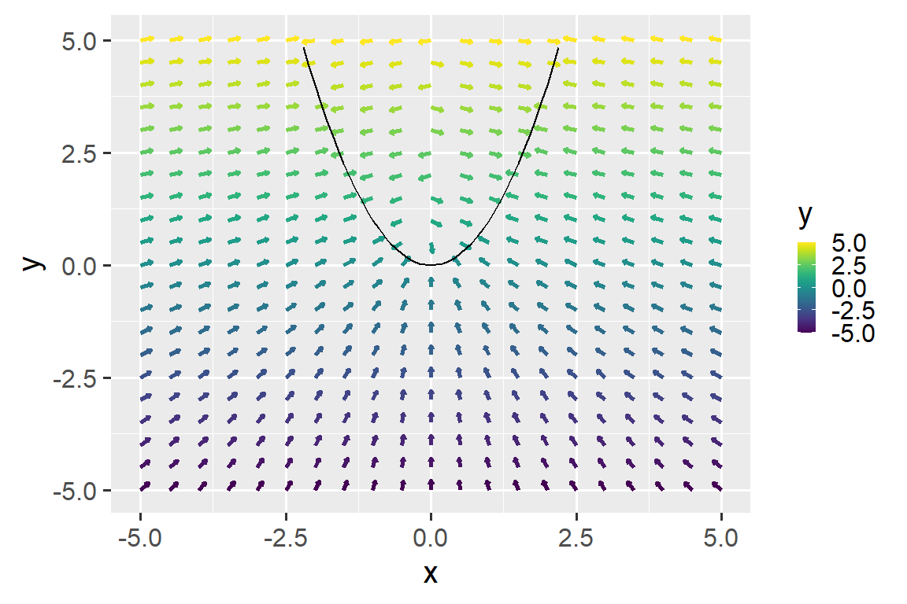<!-- -->

We can track these sudden changes in projection direction. For the
vectors extending from each point to the point on the curve it projects
to, we can compute the finite gradient magnitude, shown in the plot
below. While the x and y axes are the same as before, the heat map
colors correspond to a differences in gradient magnitude moving
diagonally to the right and upwards along the plot surface. We see that
at or around

upward (with some jitteriness apparently due to variability in the
projection function), there is a sudden shift in the direction of
projection.

``` r
print(result[[2]])
```

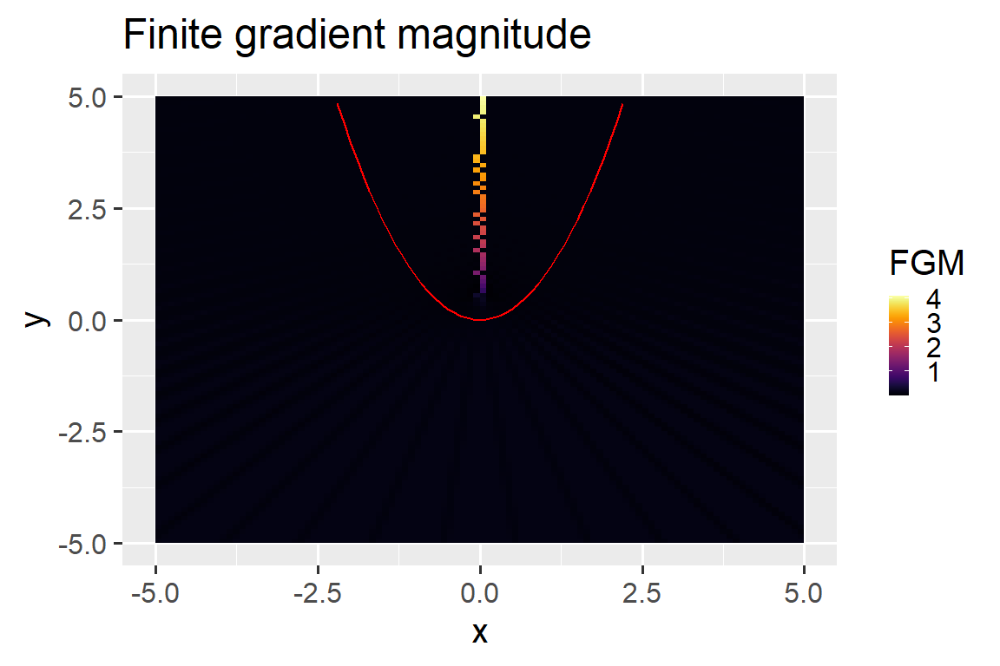<!-- -->

As discussed above, data that sit along this region or cross it may not
behave in the way we like. What does our grid look like when we project
it onto this curve?

``` r
print(result[[3]])
```

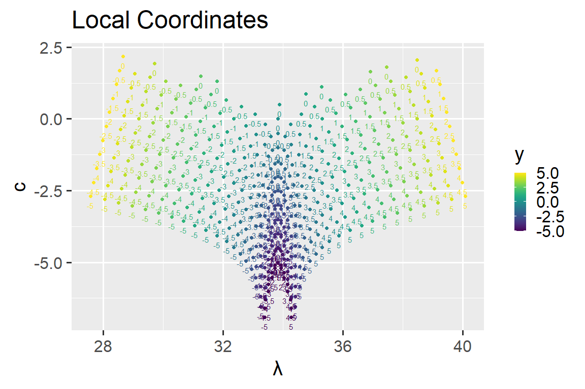<!-- -->

Unlike the first example, it is not possible to describe the
transformation to the data as a simple rotation. It seems to be
stretched in some fashion. A few items worth noting:

1.  If you identify the points that sit along
    ,
    these are the same as the points that would lie along
    .

2.  At above
    ,
    the grid seems to be split in two\! If you trace the line originally
    at
    
    (the brightest yellow), for example, you will reach a discontinuity
    and the line will then continue elsewhere. This is one of the
    dangers of having data that lie on or cross regions with non-unique
    nearest principal curve points - crossing these regions results in a
    discontinuity in the local coordinate system.

3.  For larger negative y-values, the data points seem to be clustered
    together more closely. The line originally at
    
    (the deepest purple) appears to take the shape of a tight parabola.

If you plan to do analysis that involves this kind of projection onto a
principal curve, it would be useful to identify the problematic regions
beforehand.

-----

## Tongue Surface Data

For this demo, I am using ultrasound video frames of rhymes from /CʌC/,
/CʌlC/, and /CVoʊC/ words produced by a speaker of American English. The
figures below plot a single video frame in the speaker’s production of
“cult” (on the left) and “soak” (on the right).

  - Higher X values correspond to a position further forward in the
    vocal tract
  - Higher Y values correspond to a higher position in the vocal tract

In the speaker’s production of “cult”, there appear to be two tongue
constrictions - one at the tongue tip and another back in the tongue
body. In contrast, for their production of “soak”, the tongue dorsum
seems to be bunched.

``` r
merged <- fread('~/p4.csv')[,-c(1,2)] ## Load Data

ggplot(merged[frame %in% c(113,291)], aes(x=x_scaled, y=y_scaled)) +
  geom_point() +
  facet_wrap(~word) +
  labs(x="x",y="y", title="Tongue Surfaces")+
  coord_fixed(ratio=0.5)
```

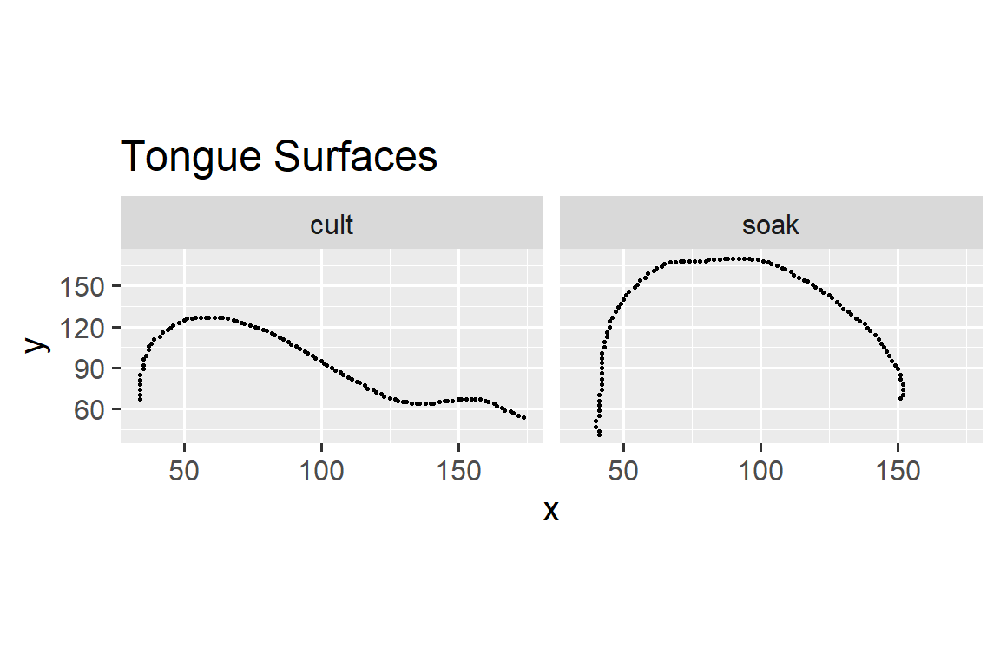<!-- -->

What if we wanted to project either of these tongue surface curves onto
the other? Analogous to the problematic region for
,
it is possible for certain tongue shapes to have regions that result in
discontinuities if another tongue is projected onto it.

This second bit of code gives projection-related information for a grid
of points centered around an arbitrary curve.

``` r
example2 <- function(curve, step){
  tol <- 1e-10
  
  x_range <- range(curve[,1],na.rm=T)
  y_range <- range(curve[,2],na.rm=T)
  
  x_mid <- mean(x_range,na.rm=T)
  y_mid <- mean(y_range,na.rm=T)

  xspan <- seq(x_mid - 2*(x_mid-x_range[1]),x_mid+2*(x_range[2]-x_mid),step)
  yspan <- seq(y_mid - 2*(y_mid-y_range[1]),y_mid+2*(y_range[2]-y_mid),step)
  
  xspan_narrow <- seq(x_mid - 2*(x_mid-x_range[1]),x_mid+2*(x_range[2]-x_mid),step/8)
  yspan_narrow <- seq(y_mid - 2*(y_mid-y_range[1]),y_mid+2*(y_range[2]-y_mid),step/8)
  
  grid <- expand.grid(xspan,yspan)
  grid_narrow <- expand.grid(xspan_narrow,yspan_narrow)
  
  
  projections <- project_to_curve(as.matrix(grid),as.matrix(curve))
  grid$angle <- apply(projections$s - grid,1, function(x){
    if (abs(x[1]) < tol & abs(x[2]) < tol){
      return(NA)
    } else {
      return(atan2(x[2],x[1]))
    }
  })
  data_f<-as.data.frame(curve)
  
  
  p1<-ggplot() +
  geom_spoke(data=grid, aes(x=Var1, y=Var2, angle=angle, radius=step/3, colour=Var2), arrow = arrow(length = unit(.05, 'inches')),size=1)+
  geom_line(data=data_f, aes(x=x_scaled,y=y_scaled),colour="black",size=1) +
  scale_colour_viridis()+
  labs(x="x",y="y", colour="y")

  projections_narrow <- project_to_curve(as.matrix(grid_narrow),as.matrix(curve))
  
  diffs <- cbind(grid_narrow,projections_narrow$s - grid_narrow)
  ## Identifying trouble spots
  xs <- diffs[,-c(4)]
  ys <- diffs[,-c(3)]
  
  xs_m <- daply(xs, .(Var1,Var2), function(x) x$"Var1.1")
  ys_m <- daply(ys, .(Var1,Var2), function(x) x$"Var2.1")

  xs_shift <- rbind(xs_m[2:nrow(xs_m),],rep(NA,ncol(xs_m)))
  colnames(xs_shift) <- NULL
  row.names(xs_shift) <- NULL

  ys_shift <- cbind(ys_m[,2:ncol(ys_m)],rep(NA,nrow(ys_m)))
  colnames(ys_shift) <- NULL
  row.names(ys_shift) <- NULL
  list(xs_shift,ys_shift)

  xdiff <- abs(xs_m - xs_shift)
  ydiff <- abs(ys_m - ys_shift)
  absol <-sqrt(ydiff^2 + xdiff^2)

  absol_df <- adply(absol,c(1,2),function(a) a)
  colnames(absol_df)[1:2] <- c('x','y')
  
  p2 <- ggplot()+
  geom_tile(data=absol_df[complete.cases(absol_df),], aes(x=as.numeric(as.character(x)), y=as.numeric(as.character(y)), fill=V1))+
  geom_point(data=data_f, aes(x=x_scaled,y=y_scaled),colour="red",size=1)+
  scale_fill_viridis(option="B")+
  labs(title="Finite gradient magnitude", x="x", y="y", fill="FGM")
   
  grid$type <- "grid"
  projections <- grid[,c(1,2,4)]
  
  projections_f <- cbind(projections,proj_simple(as.matrix(projections[,c(1,2)]),as.matrix(curve),T))
   
   p3 <- ggplot() +
     geom_point(data=projections_f[projections_f$type == 'grid',], aes(x=lambda, y=c, colour=Var2, group=Var1),size=2)+
     geom_text(data=projections_f[projections_f$type == 'grid',], aes(x=lambda, y=c, colour=Var2, label=round(Var1,2)),size=4,vjust=1.5)+
     scale_colour_viridis(option="viridis")+
     labs(x="\u03BB",y="c", title="Local Coordinates",colour="y")
   return(list(p1,p2,p3))
}
```

-----

Looking at the tongue surface for ‘soak’, we notice that there seems to
be a sudden change in projection direction directly below the tongue
dorsum but not really elsewhere.

``` r
soak <- merged[frame==291,c('x_scaled','y_scaled')]
soak_pc <- principal_curve(as.matrix(soak))
test <-project_to_curve(as.matrix(soak),soak_pc$s[soak_pc$ord,])
soak_srt <- soak[test$ord,]
result <- example2(soak_srt,10)

print(result[[1]])
```

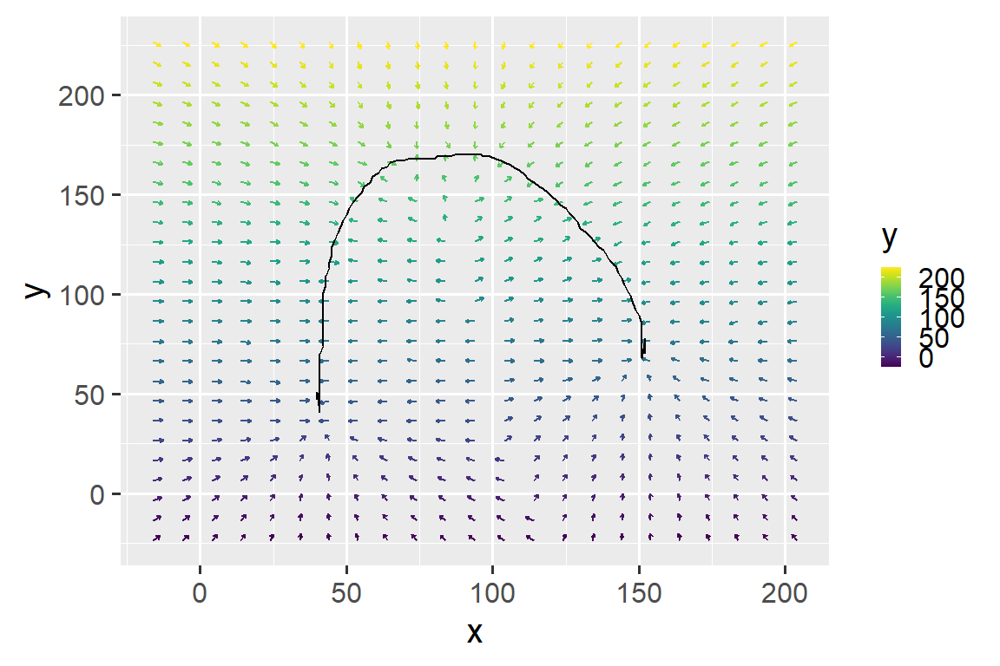<!-- -->

This observation is confirmed by the plot of finite gradient magnitude.
There is a sharp change in gradient magnitude along a curve extending
downward from the tongue dorsum.

``` r
print(result[[2]])
```

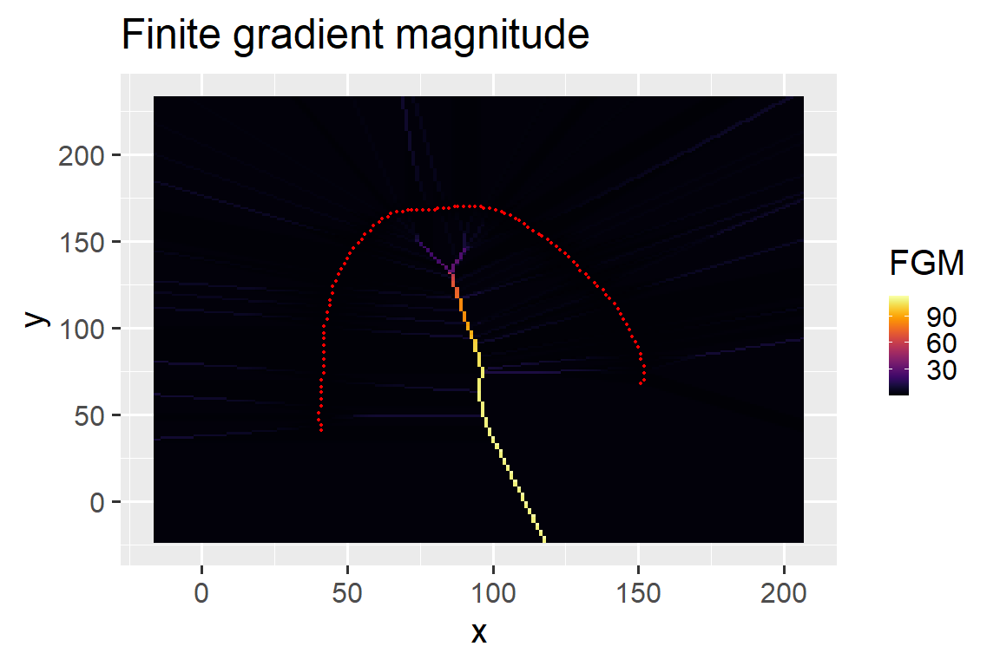<!-- --> What does this mean if we
decide to project additional tongue curves onto this shape? In the plot
below we see that grid is ‘split’ in the region identified from the
previous plot. If a line is traced along

(bluish-teal), for example, a discontinuity is encountered.

This tongue surface could be useful be useful to project others onto it
if the other tongue surfaces did not cross the region corresponding to
discontinuity. An \[o\] production is somewhat constricted at the uvula
and is otherwise unconstricted elsewhere, so it may be possible to
satisfy this constraint depending on your data set.

``` r
print(result[[3]])
```

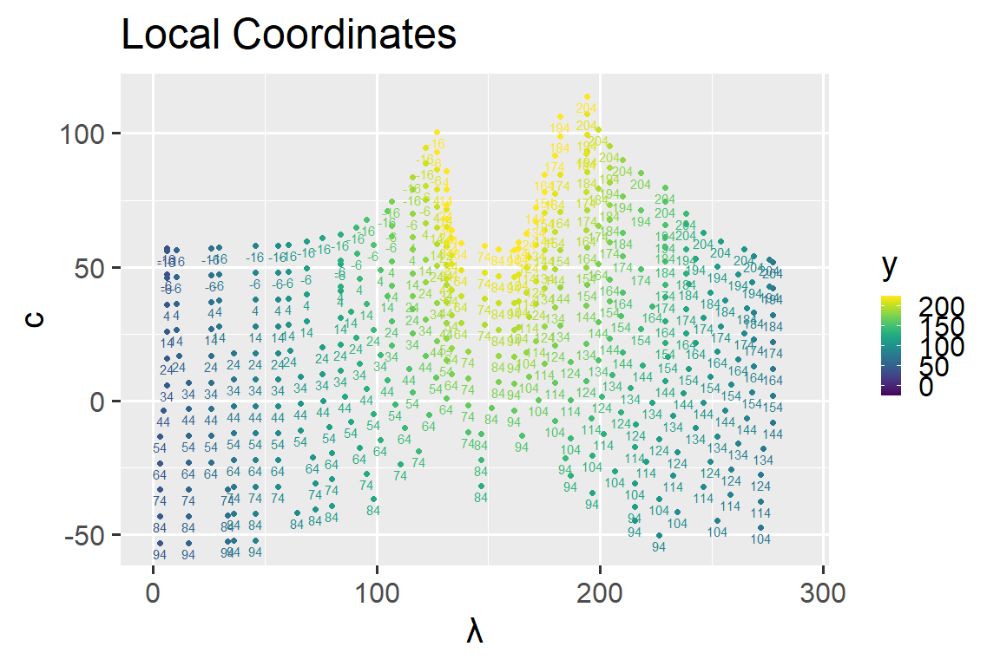<!-- --> What if we tried to use
the image frame for ‘cult’? From the figure below, there appear to be
several regions that show sudden change in the direction of the
projected point.

-----

``` r
cult <- merged[frame==113,c('x_scaled','y_scaled')]
cult_pc <- principal_curve(as.matrix(cult))
test <-project_to_curve(as.matrix(cult),cult_pc$s[cult_pc$ord,])
cult_srt <- cult[test$ord,]
result <- example2(cult_srt,10)
print(result[[2]])
```

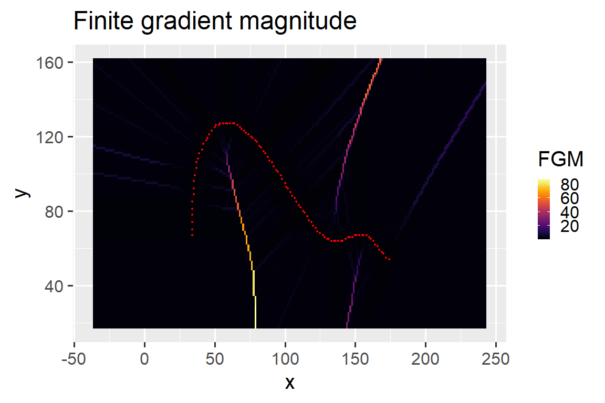<!-- -->

As you might guess, it would be very difficult to project a tongue
surface onto this particular curve without running into discontinuities
unless it already happened to lie close to the xcurve.

``` r
print(result[[3]])
```

<!-- -->

-----

I’ve chosen a production that is suitable for the data set I’m working
with. This a vowel-initial ultrasound production of ‘suck’.

``` r
suck <- merged[word=='suck' & rep==1 & nucpoint==0,c('x_scaled','y_scaled')]
suck_pc <- principal_curve(as.matrix(suck))
test <-project_to_curve(as.matrix(suck),suck_pc$s[suck_pc$ord,])
suck_srt <- suck[test$ord,]
result <- example2(suck_srt,10)
print(result[[2]])
```

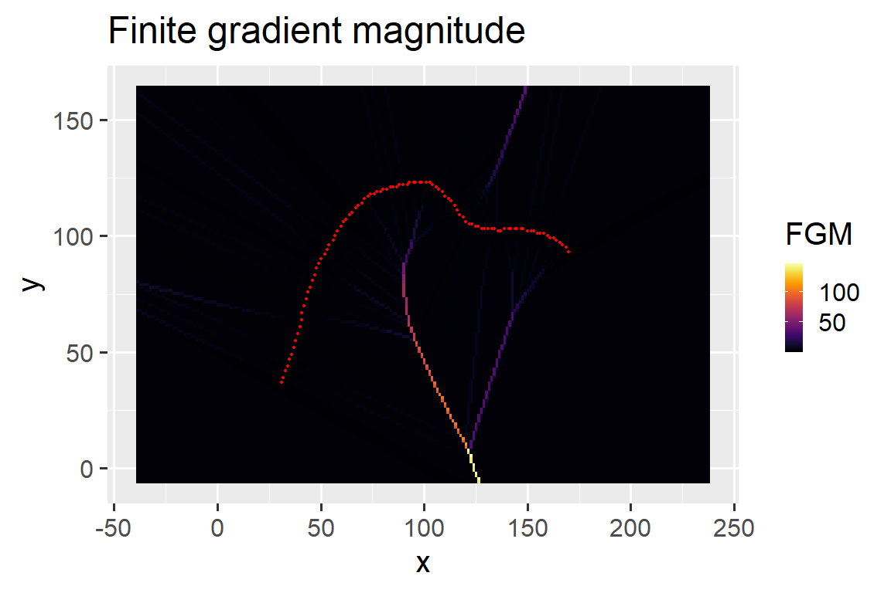<!-- --> These are the two frames
from earlier projected onto this production of suck. A few things to
note:

1.  These new curves do not appear to have discontinuities\!

2.  The y-position seems to match with constriction degree relative to
    ‘suck’ at that location in the tongue. ‘Soak’ shows greater
    constriction at the tongue dorsum and not much constriction
    elsewhere, while ‘cult’ shows more constriction closer to the tongue
    root and relatively low constriction elsewhere.

The main utility of these projections will be to identify changes in
constriction degree and constriction location over time.

``` r
news <- cbind(merged[frame %in% c(113,291),],proj_simple(as.matrix(merged[frame %in% c(113,291),c('x_scaled','y_scaled')]),suck_srt))
ggplot(news, aes(x=200-lambda,y=c))+
geom_point() +
facet_wrap(~frame)+
labs(x="\u03BB", y="c")
```

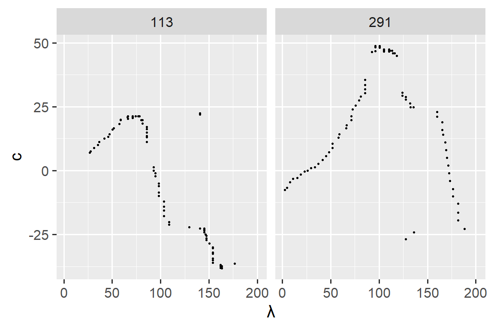<!-- -->

``` r
news <- proj_simple(as.matrix(merged[,c('x_scaled','y_scaled')]),suck_srt)
```

More sections to come soon…
